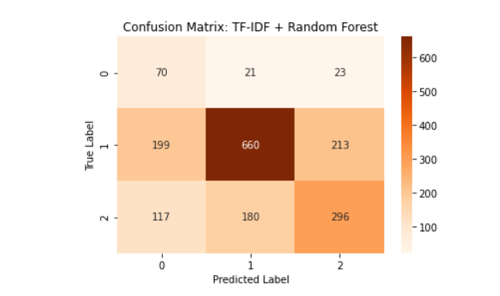
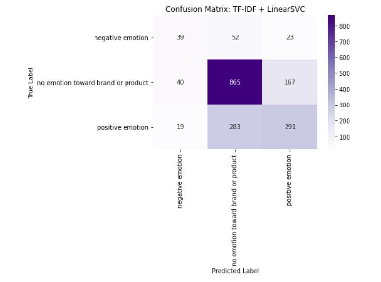
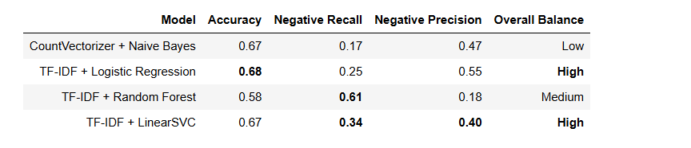

# Twitter Sentiment Classification Using NLP for Product Intelligence

## An End-to-End Machine Learning Project for ElecTech

---

## Project Overview

This project implements an **automated sentiment classification system** to categorize Twitter posts about **Apple** and **Google** products into:

- **Positive**  
- **Negative**  
- **Neutral**

The system helps **ElecTech** quickly identify actionable insights from customer feedback, enabling faster responses and informed decision-making.

---

## Business Problem

Manual monitoring of tweets is inefficient and risky:

- Negative feedback may go unnoticed  
- Positive trends may be missed  
- Marketing and inventory decisions may be delayed  

By automating sentiment triage, ElecTech can:

- Detect early warning signs of dissatisfaction  
- Capitalize on positive sentiment  
- Improve operational efficiency  

---

## Project Objectives

- Automate tweet sentiment classification  
- Reduce noise from neutral or non-actionable content  
- Identify early warning signals of negative sentiment  
- Support marketing and inventory strategy  
- Develop a scalable, reproducible ML pipeline  

---

## Dataset Description

The dataset contains tweets about Apple and Google products. Key columns:

| Column | Description |
|--------|-------------|
| `tweet_text` | Content of the tweet |
| `emotion_in_tweet_is_directed_at` | Target product/brand (metadata) |
| `is_there_an_emotion_directed_at_a_brand_or_product` | Sentiment label |

**Sentiment Classes:**  
- `negative emotion`  
- `positive emotion`  
- `no emotion toward brand or product`  

---

## Data Cleaning & Preprocessing

Key steps:

1. Removed rows with missing or duplicate tweets  
2. Dropped ambiguous labels like `"i can't tell"`  
3. Standardized text casing and removed whitespace  
4. Removed URLs, mentions, hashtags, numbers, and special characters  
5. Tokenized, removed stopwords, and applied lemmatization  
6. Encoded sentiment labels numerically  

This resulted in a clean dataset ready for feature extraction and modeling.

---

## Feature Engineering

Text transformed into numerical features using:

- **Count Vectorization (Bag-of-Words)** for baseline models  
- **TF-IDF Vectorization** for advanced models, emphasizing sentiment-bearing words  

---

## Machine Learning Models

### 1. Baseline Model: CountVectorizer + Multinomial Naive Bayes

- Fast, interpretable, and simple  
- Serves as a benchmark  
- Limited performance on minority classes  

**Confusion Matrix:**  

---

### 2. Primary Model: TF-IDF + Logistic Regression

- Down-weights common words, emphasizes informative terms  
- Clear linear decision boundaries  
- Hyperparameter tuning via **GridSearchCV**  
- Balanced performance across all classes  

**Confusion Matrix:**  

---

### 3. Advanced Model: TF-IDF + Random Forest

- Captures non-linear relationships in text  
- High sensitivity to negative sentiment  
- Precision suffers due to false positives  

**Confusion Matrix:**  

---

### 4. Advanced Model: TF-IDF + Linear Support Vector Classifier

- Handles high-dimensional sparse text data efficiently  
- Maximizes margin between classes  
- Balanced precision and recall, handles class imbalance  

**Confusion Matrix:**  

---

## Model Evaluation

Metrics used:

- **Precision, Recall, F1-score**  
- **Macro & Weighted averages**  
- **Confusion matrices**  

**Cross-Model Comparison:**  

| Model | Accuracy | Negative Recall | Negative Precision | Overall Balance |
|-------|----------|----------------|------------------|----------------|
| Naive Bayes | 0.67 | 0.17 | 0.47 | Low |
| Logistic Regression | 0.68 | 0.25 | 0.55 | High |
| Random Forest | 0.58 | 0.61 | 0.18 | Medium |
| LinearSVC | 0.67 | 0.34 | 0.40 | High |

---

## Final Recommendation

**Recommended Model:** **TF-IDF + Logistic Regression**

- Offers balanced performance across all classes  
- Improves negative sentiment detection without excessive false positives  
- Maintains strong precision for positive and neutral tweets  
- Scalable, interpretable, and easy to maintain  

> From a business perspective, this model enables **ElecTech** to triage Twitter sentiment efficiently, acting quickly on complaints while capturing positive trends.

---

## Technologies Used

- **Python** – Programming language  
- **Pandas, NumPy** – Data manipulation  
- **Scikit-learn** – ML pipelines, modeling, evaluation  
- **NLTK** – NLP preprocessing  
- **Matplotlib, Seaborn** – Visualization  
- **Jupyter Notebook** – Interactive analysis  

---
